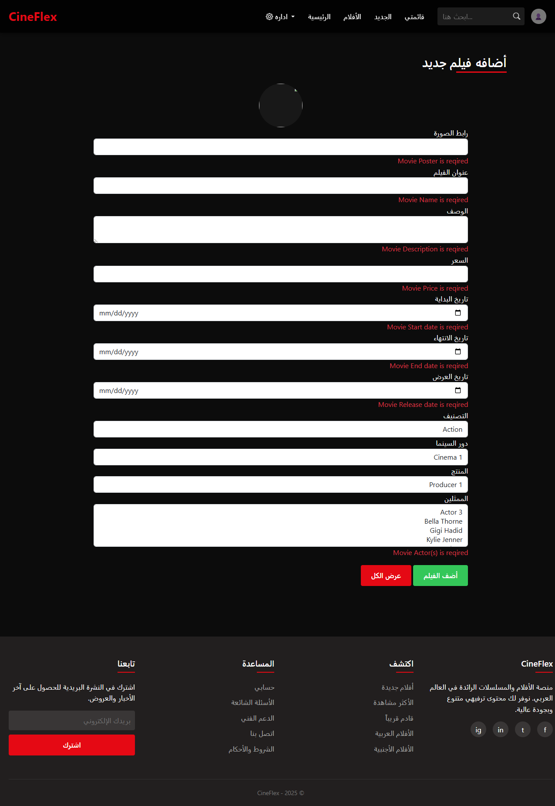
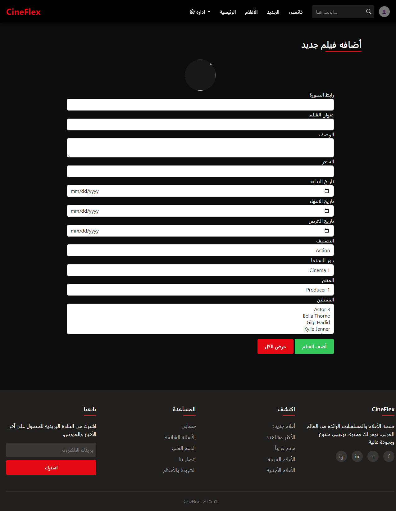
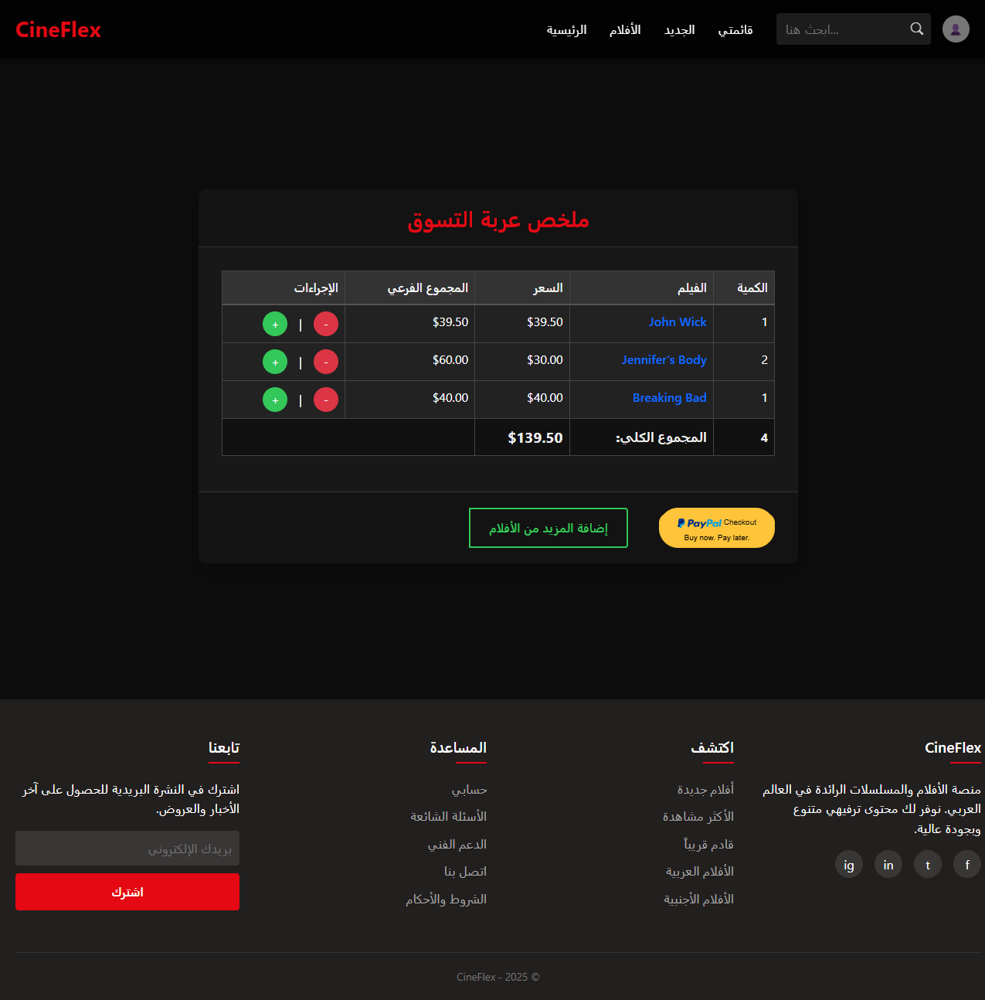

# CineFlex Movie Booking System

Welcome to the CineFlex Movie Booking System project! This web application allows users to browse and book tickets for movies, manage movie data and provides an admin panel to handle movie, cinema, actor, and producer information.

## Table of Contents

- [Getting Started](#getting-started)
- [Features](#features)
- [Usage](#usage)
   - [User](#user)
   - [Admin Panel](#admin-panel)

## Getting Started

To get started with the CineFlex Movie Booking System, follow these steps:

### Prerequisites

- [.NET Core SDK](https://dotnet.microsoft.com/download)
- [Visual Studio](https://visualstudio.microsoft.com/downloads/) or any other code editor of your choice
- [SQL Server](https://www.microsoft.com/en-us/sql-server/sql-server-downloads) for database management

### Installation

1. Clone the repository to your local machine:

   ```
   git clone https://github.com/UsfHajaj/CineFlex.git
   ```
2- Open the project in Visual Studio or your preferred code editor.

3- Create a database and update the connection string in the appsettings.json file to point to your database.

4- Run the database migrations to create the required tables:
    ```
    dotnet ef database update
    ```

5- Build and run the application:
    ```dotnet run```
    
### features
- Browse and search for movies.
- View movie details,  actors, producers, and cinema information.
- Purchase tickets for movies.
- View the list of orders
- Admin panel for managing movie, cinema, actor, producer, and order data.

### usage

### User:
   - Browse the list of movies.
   - Click on a movie to view its details then you can view actors, cinema, and producer details
   - Select the number of movie tickets you want to purchase and complete the booking process.
### Admin Panel:
   - Add new movies, cinemas, actors, and producers.
   - Edit or delete existing movie, cinema, actor, and producer data.
   - Show all users that register to the app.
   - Show a list of all user's orders.

## 📸 Screenshots









